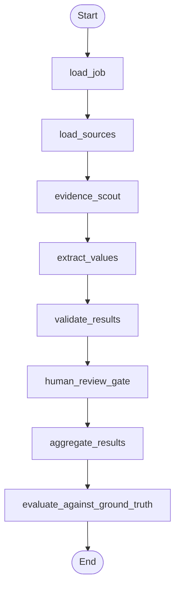

# Agentic Document Extraction with LangGraph

A dictionary-driven agentic document extraction framework built with LangGraph,
demonstrated on synthetic ESG disclosures.

This project is designed as a clean-room portfolio example: it shows reusable
agentic workflow design, structured schemas, evidence traceability, validation,
human review gates, and evaluation without including proprietary code, data,
prompts, or methodology.

## Why This Exists

Many document extraction projects become hardcoded around one domain. This
project keeps the extraction engine generic and makes the dictionary the main
control surface. A domain pack supplies field definitions, evidence hints,
validation rules, sample documents, and ground truth.

The included ESG demo is one domain pack, not the framework limit.

## Workflow



## Project Structure

```text
src/doc_extractor/      Generic extraction engine
domains/esg/            Synthetic ESG domain pack
examples/               Runnable demos
docs/                   Architecture and confidentiality notes
tests/                  Unit and end-to-end tests
```

## Quick Start

```powershell
python -m venv .venv
.\.venv\Scripts\Activate.ps1
pip install -e ".[dev]"
python examples/run_esg_demo.py
```

The default demo uses the deterministic fake provider and does not require an
API key.

## Optional Gemini Provider

Gemini support is optional and configured only through environment variables:

```powershell
copy .env.example .env
# Edit .env with your own key, then:
$env:DOC_EXTRACTOR_PROVIDER="gemini"
$env:GOOGLE_API_KEY="your_api_key_here"
```

No cloud project IDs, bucket names, credentials, prompts, or private paths are
hardcoded in this repository.

## Example Dictionary Entry

```json
{
  "id": "scope_1_emissions",
  "label": "Scope 1 greenhouse gas emissions",
  "definition": "Direct greenhouse gas emissions from owned or controlled sources.",
  "expected_type": "number",
  "expected_unit": "tCO2e",
  "evidence_rules": {
    "keywords": ["Scope 1 greenhouse gas emissions"]
  }
}
```

## What The Demo Shows

- dictionary-driven extraction
- source-level evidence traceability
- type, unit, evidence, and confidence validation
- human review queue for missing or uncertain fields
- field-level evaluation against synthetic ground truth
- pluggable provider interface for future LLM backends

## Portfolio Positioning

Suggested wording:

> Built a clean-room, dictionary-driven agentic document extraction framework
> using LangGraph and Pydantic. The framework extracts structured fields from
> documents using configurable field definitions, evidence rules, validation
> gates, human review routing, and evaluation metrics. Demonstrated with a
> synthetic ESG disclosure domain pack.

## Confidentiality

This repository is intentionally clean-room. It does not contain proprietary
code, data, prompts, model configurations, cloud metadata, generated outputs,
client identifiers, or internal ESG methodology.
