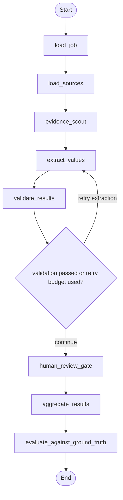

# Agentic Document Extraction with LangGraph

A dictionary-driven agentic document extraction framework built with LangGraph,
demonstrated on synthetic ESG disclosures.

This project is designed as a clean-room portfolio example: it shows reusable
agentic workflow design, structured schemas, evidence traceability, validation,
human review gates, and evaluation without including proprietary code, data,
prompts, or methodology.

## Why This Exists

Many document extraction projects become hardcoded around one domain. This
project keeps the extraction engine generic and makes the dictionary the main
control surface. A domain pack supplies field definitions, evidence hints,
validation rules, sample documents, and ground truth.

The included ESG demo is one domain pack, not the framework limit.

## Workflow



The validation step can route failed or uncertain fields back to extraction.
After the configured retry budget is used, unresolved fields move to the human
review queue instead of being silently accepted.

## Project Structure

```text
src/doc_extractor/      Generic extraction engine
domains/esg/            Synthetic ESG domain pack
domains/procurement/    Synthetic procurement domain pack
examples/               Runnable demos
docs/                   Architecture and confidentiality notes
tests/                  Unit and end-to-end tests
```

See `docs/agents.md` for the clean-room agent role map.

## Quick Start

```powershell
python -m venv .venv-agentic-doc
.\.venv-agentic-doc\Scripts\Activate.ps1
pip install -e ".[dev]"
python examples/run_esg_demo.py
python examples/run_procurement_demo.py
```

The default demo uses the deterministic fake provider and does not require an
API key.

## Optional Gemini Provider

Gemini support is optional and configured only through environment variables:

```powershell
copy .env.example .env
pip install -e ".[gemini]"
# Edit .env with your own key, then:
$env:DOC_EXTRACTOR_PROVIDER="gemini"
$env:GOOGLE_API_KEY="your_api_key_here"
```

No cloud project IDs, bucket names, credentials, prompts, or private paths are
hardcoded in this repository.

## Example Dictionary Entry

```json
{
  "id": "scope_1_emissions",
  "label": "Scope 1 greenhouse gas emissions",
  "definition": "Direct greenhouse gas emissions from owned or controlled sources.",
  "expected_type": "number",
  "expected_unit": "tCO2e",
  "evidence_rules": {
    "keywords": ["Scope 1 greenhouse gas emissions"]
  }
}
```

## What The Demo Shows

- dictionary-driven extraction
- synthetic source discovery, URL ranking, and URL verification contracts
- source-level evidence traceability
- type, unit, evidence, and confidence validation with retry routing
- human review queue for missing or uncertain fields
- optional SQLite checkpoint snapshots
- field-level evaluation against synthetic ground truth
- pluggable provider interface for future LLM backends
- clean agent role contracts for URL discovery, inside-out extraction,
  outside-in extraction, validation, and orchestration

## Adapting The Framework

To add a new extraction domain, create a folder under `domains/` with:

- `dictionary.json` for field definitions, evidence rules, units, and validation hints
- `job.json` for entity metadata, source documents, source references, and run options
- `reports/` containing synthetic or public-safe source documents
- `ground_truth/` when you want evaluation metrics

The `procurement` demo shows the source pipeline. Candidate references are
proposed by `url_extraction`, ranked by `url_ranking`, checked by
`url_verification`, then routed to the extraction workflow.

## Prompt Design

This public repo intentionally avoids proprietary prompts. For interview use,
include concise, generic prompt templates or prompt contracts only when they
help explain the agent responsibilities. Good public prompts should describe the
input contract, evidence requirements, output schema, validation feedback, and
retry behavior without copying private wording, examples, model settings, or
domain-specific methodology.

## Portfolio Positioning

> Built a clean-room, dictionary-driven agentic document extraction framework
> using LangGraph and Pydantic. The framework extracts structured fields from
> documents using configurable field definitions, evidence rules, validation
> gates, retry routing, human review queues, and evaluation metrics.
> Demonstrated with a synthetic ESG disclosure domain pack.

## Confidentiality

This repository is intentionally clean-room. It does not contain proprietary
code, data, prompts, model configurations, cloud metadata, generated outputs,
client identifiers, or internal ESG methodology.
